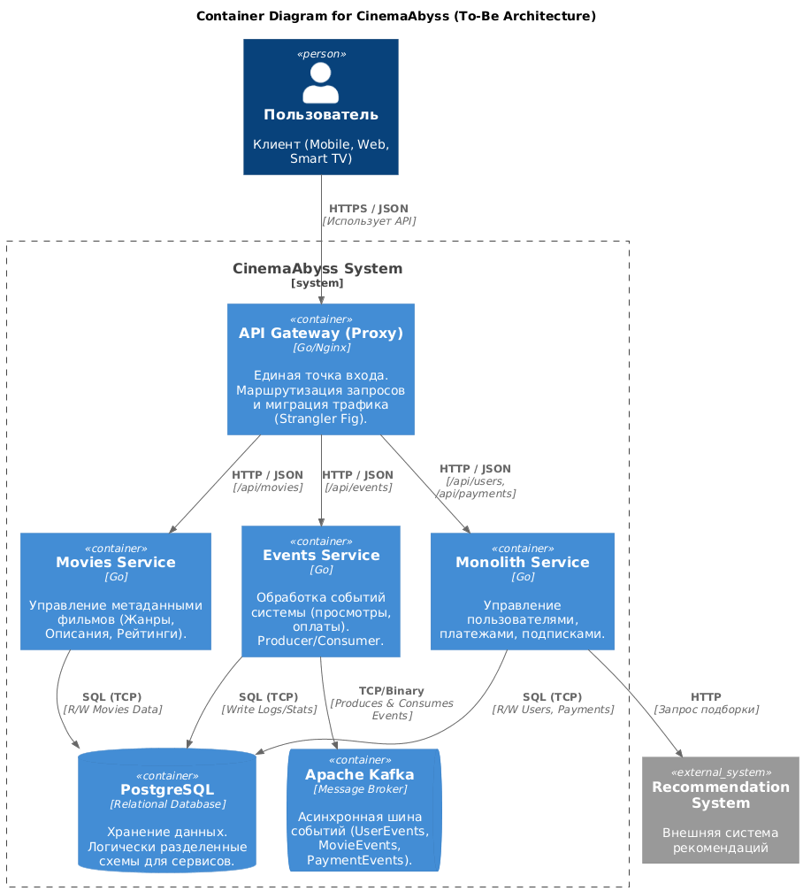
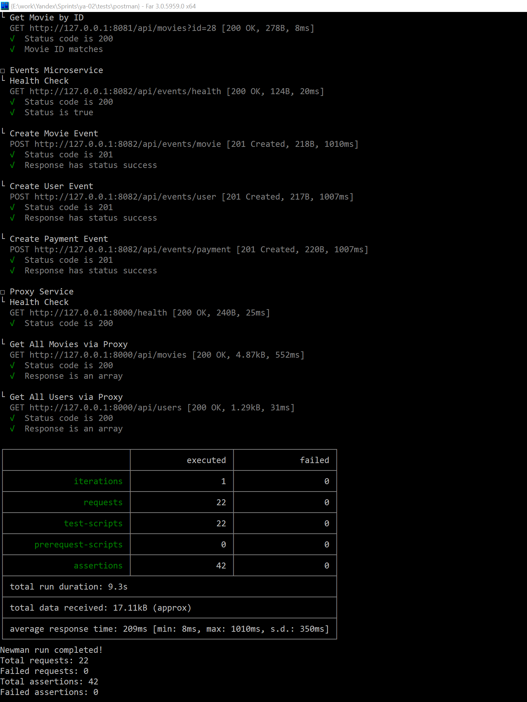
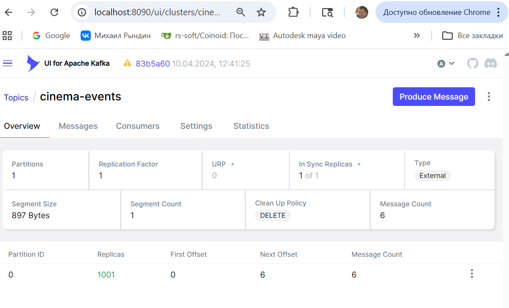
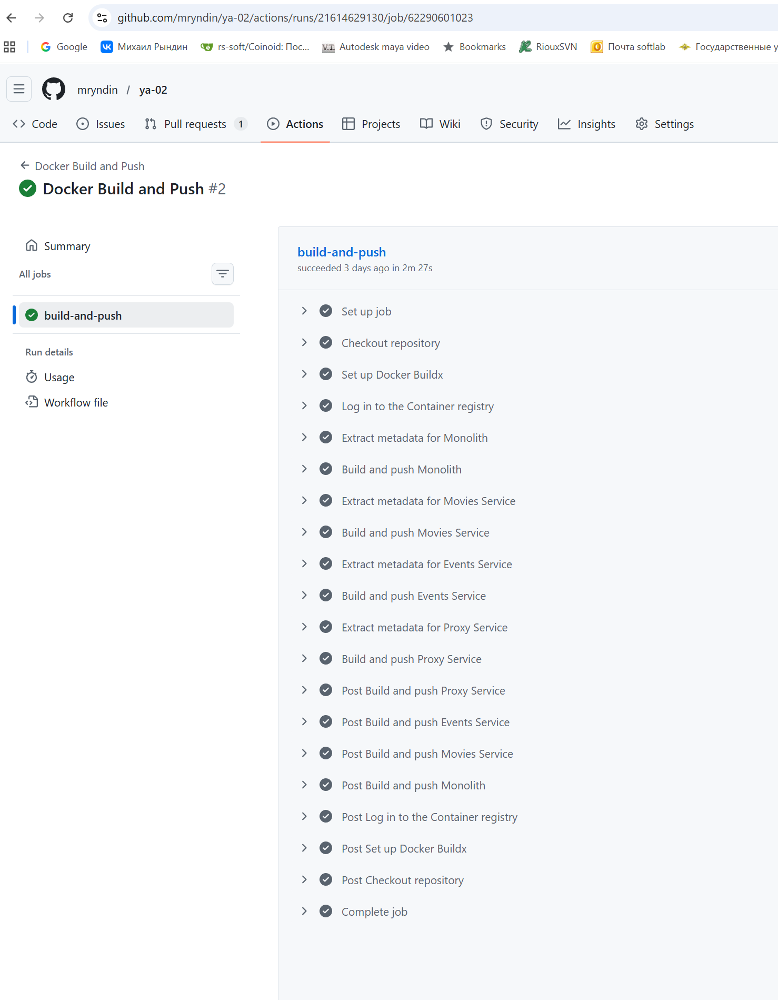
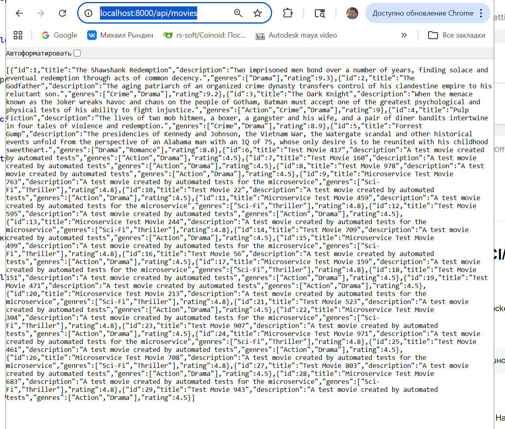
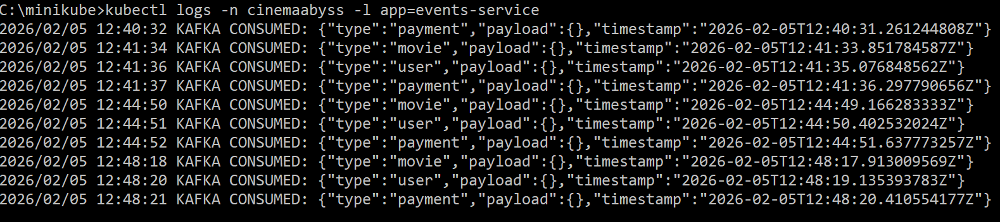
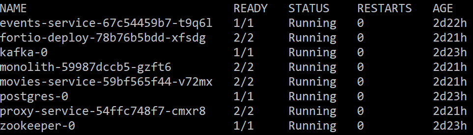
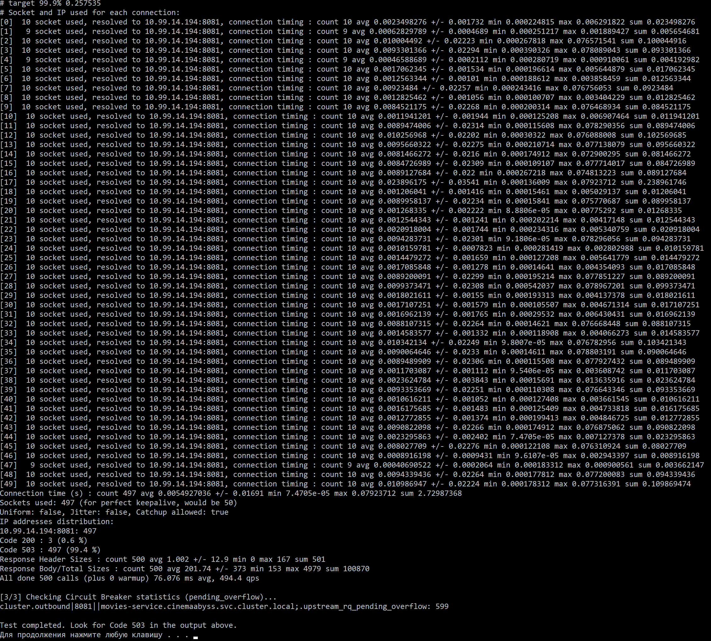

# Отчет по проекту трансформации «КиноБездны»

### Локальное тестирование и маппинг портов

Для проведения интеграционного тестирования в локальном окружении (Minikube) был выполнен проброс портов (Port Forwarding). Это позволило эмулировать доступ к сервисам так, как если бы они работали в Docker Compose, обеспечив совместимость с существующими тестовыми сценариями.

**Использованные команды:**
- `kubectl port-forward svc/proxy-service 8000:80 -n cinemaabyss` — основной вход Proxy (Strangler Fig).
- `kubectl port-forward svc/proxy-service 8080:80 -n cinemaabyss` — альтернативный порт для тестов монолита.
- `kubectl port-forward svc/movies-service 8081:8081 -n cinemaabyss` — доступ к микросервису метаданных.
- `kubectl port-forward svc/events-service 8082:8082 -n cinemaabyss` — доступ к сервису событий Kafka.

**ПРЕДУПРЕЖДЕНИЕ! Тестировалось на Windows 10**

## Задание 1: Проектирование архитектуры To-Be

Спроектирована целевая архитектура системы с разделением на домены, использованием API Gateway и асинхронного взаимодействия через Kafka.

**Решение:**

[Исходный код диаграммы](./diagrams/to-be/container.yml)

* **Entry Point:** Proxy Service скрывает сложность бэкенда.
* **Strangler Fig:** Реализован постепенный перенос трафика на Movies Service.
* **Kafka:** Асинхронная обработка событий (User/Payment/Movie).
* **Масштабируемость:** Независимое масштабирование Movies Service.

---

## Задание 2: Реализация Proxy и Kafka

### 1. Proxy Service (Strangler Fig)
Реализован прокси-сервис с поддержкой фиче-флага `GRADUAL_MIGRATION` и весовым распределением трафика через `MOVIES_MIGRATION_PERCENT`.

### 2. Kafka MVP
Разработан сервис `events`, реализующий паттерн Producer-Consumer для обработки системных событий.

**Результаты тестирования Kafka:**
**Результат:**
Запуск тестов командой `run-tests.bat -e local` завершился успешно (Status: OK). Все эндпоинты доступны, взаимодействие между Proxy, микросервисами и Kafka стабильно.

**Состояние топиков Kafka (UI):**

---

## Задание 3: Kubernetes и CI/CD

### CI/CD Pipeline
Настроен GitHub Actions пайплайн для сборки Docker-образов и их публикации в GitHub Container Registry (GHCR).

**Результат сборки:**

### Deployment в K8s
Система развернута в namespace `cinemaabyss`. Настроены Ingress, ConfigMaps и Secrets.

**Проверка работы API через Ingress:**

**Логи event-service (обработка событий):**

---

## Задание 4: Helm-чарты

Проведена шаблонизация манифестов. Все сервисы упакованы в единый Helm-чарт для упрощения деплоя и управления релизами.

**Результат развертывания через Helm:**

**Доступность сервиса после Helm-деплоя:**

---

## Задание 5: Istio и Circuit Breaker

Внедрена сервисная сетка Istio. Настроена политика отказоустойчивости (Circuit Breaker) для защиты системы от каскадных сбоев при перегрузке Movies Service.

**Результаты нагрузочного тестирования (Fortio):**

---
*Работа выполнена в рамках курса по архитектуре микросервисов.*